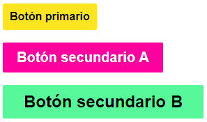
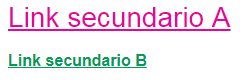
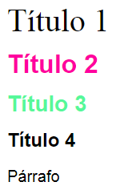

# < L > styleguide

Esta guia de estilos está diseñada con el uso componentes React que pueden combinarse para ayudar a los desarrolladores a crear los diferentes productos digitales de Laboratoria.

## Instalación

Ejecute el siguiente comando usando npm:

~~~
npm install laboratoria-style-guide
~~~

## Uso

1. Incluya en su proyecto cualquiera de los componentes proporcionados por esta guía de estilos:

```javascript
import {Button, Typography, Link} from 'laboratoria-style-guide';
```

2. Renderizar el elemento en el DOM con React:

``` jsx
ReactDOM.render(
  <div>
    <Typography h1 bitter> Título 1 </Typography>
    <Button primary small> Botón primario </Button>
    <Link p colorSB bold> Link secundario B </Link>
  </div>,
  document.querySelector('#app')
);
```

## Ejemplos

### 1. Botones



```jsx
ReactDOM.render(
  <div>
    <Button primary small> Botón primario </Button>
    <Button secondaryA medium> Botón secundario </Button>
    <Button secondaryB large> Botón secundario </Button>
  </div>,
  document.querySelector('#app')
);
```

 Estilos | Opciones
------------ | -------------
Tamaño botón | small, medium, large
Tipo botón | primary, secondaryA, secondaryB

### 2. Links



```jsx
ReactDOM.render(
  <div>
    <Link h3 colorSA> Link secundario A </Link>
    <Link p colorSB bold> Link secundario B </Link>
  </div>,
  document.querySelector('#app')
);
```

 Estilos | Opciones
------------ | -------------
Tipo link | colorSA, colorSB
Tamaño fuente | h1, h2, h3, h4, paragraph
Grosor fuente | bold

### 3. Tipografía



```jsx
ReactDOM.render(
  <div>
    <Typography h1 bitter> Título 1 </Typography>
    <Typography h2 bold colorSA> Título 2 </Typography>
    <Typography h3 bold colorSB> Título 3 </Typography>
    <Typography h4 bold> Título 4 </Typography>
    <Typography paragraph> Párrafo </Typography>
  </div>,
  document.querySelector('#app')
);
```

 Estilos | Opciones
------------ | -------------
Tipo fuente | bitter, (por defecto: 'Open Sans', sans-serif)
Tamaño fuente | h1, h2, h3, h4, paragraph
Color fuente | colorP, colorSA, colorSB
Grosor fuente | bold